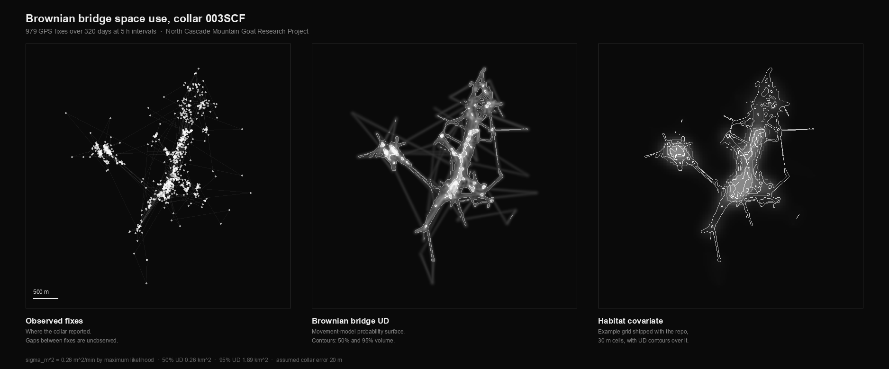

# ncmgrp

Spatial usage analysis for the **North Cascade Mountain Goat Research Project**:
Brownian bridge movement models and synoptic habitat-selection models fitted to
GPS collar telemetry, parallelized with MPI to run on an HPC cluster.

University of Idaho and Washington State University, Colleges of Natural
Resources. Archival research code, 2011.



<sub>Computed from `BB/data/003SCF.dat` by `docs/make_figure.py`: 979 fixes over
320 days. Left, the raw collar locations. Centre, the Brownian bridge
utilisation distribution the model derives from them. Right, the example
covariate grid with the 50% and 95% UD contours over it.</sub>

## Background

Estimating where an animal actually spends its time from a sparse GPS track is
not a matter of drawing a polygon around the points. A Brownian bridge movement
model treats the path between two fixes as a random walk conditioned on both
endpoints, and integrates the resulting probability density to produce a
utilization distribution. The synoptic model extends that by fitting habitat
covariates against the movement-derived null, so selection is measured relative
to what the animal could plausibly have reached rather than to the study area as
a whole.

The fitted models under `BB/F111/` use the covariate set recorded in
`f111_summer_buffer_locs_CoVar_MinMax.txt`, measured in a 240 m moving window:
elevation, slope, forest cover, distance to trees, distance to high ground,
distance to escape terrain, ruggedness and aspect, road distance, and modelled
elk, wolf, and alternate-species use. Model output such as
`..._ExpPower_Model10_Out.txt` carries the parameter table, covariance matrix,
AICc, convergence flag, and wall-clock fit time.

This work supported the co-authored paper *"The Brownian bridge synoptic model of
habitat selection and space use for animals using GPS telemetry data."*

The serial Brownian bridge estimator in `BB/supplement_A.R` is adapted from the
supplementary R code published with Sawyer et al. (MS#08-2034). Everything
concerning parallelization, cluster execution, scaling analysis, and batch
processing across the collar dataset is original to this repository.

## The problem this code solves

Fitting these models over a full season of fixes for one animal took hours. The
project had dozens of collared animals, and each model variant had to be refit
across multiple spatial extents. Run serially, a single sweep of the dataset was
a multi-week proposition, which is slow enough that it stops being a research
tool and starts being a scheduling problem.

The work here moves that onto a cluster and establishes how much speedup the
problem can actually absorb.

## Layout

| Path | Contents |
|---|---|
| `BB/` | Brownian bridge utilization distributions |
| `BB/supplement_A.R` | Serial reference implementation |
| `BB/supplement_A-par.R` | MPI-parallel version, `Rmpi` + `snow` |
| `BB/run.sh` | Batch harness: sweeps every collar in `data/` |
| `BB/R.sh` | Sun Grid Engine submission script |
| `BB/data/` | Per-animal GPS fix files |
| `BB/F111/` | Fitted model output for one animal across extents |
| `SYN2/` | Synoptic habitat-selection models |
| `SYN2/synbb.r` | Driver: Brownian bridge plus synoptic, serial or parallel |
| `SYN2/bb.r`, `syn.r`, `gen.r` | Decomposed model components |
| `SYN2/amdahl.r` | Parallel scaling analysis, see below |
| `merger/merge.R` | Joins GPS fixes to collar activity-sensor streams |
| `docs/make_figure.py` | Regenerates the figure above from the collar data |

Collar data files are named `<id><area><sex>.dat`, for example `003SCF.dat`,
with `F` and `M` as the trailing sex code.

## Parallelization

`supplement_A-par.R` and `SYN2/synbb.r` distribute model fitting across MPI
workers via `Rmpi` and `snow`:

```r
c1 <- makeCluster(nodes, type = "MPI")
```

`synbb.r` takes `-p <nodes>` to set worker count and `--bb-only` / `--syn-only`
to run either stage independently, so the expensive Brownian bridge step can be
computed once and reused across synoptic model variants.

Cluster jobs are submitted through Sun Grid Engine:

```sh
#$ -cwd
#$ -pe orte 4
#$ -V
module load openmpi
module load R
```

## Scaling analysis

`SYN2/amdahl.r` is the part worth reading. Rather than assuming more workers
means proportionally faster, it models Amdahl's law with a per-worker overhead
term:

```r
amdahl <- function(workers, overhead, p) {
  return(abs(1 / (((1 - p) + (overhead * workers)) + (p / workers))))
}
```

where `p` is the parallelizable fraction and `overhead` is the real,
**empirically measured** cost of adding a worker. The script spins up a cluster,
times a trivial `parLapply` across it to isolate startup and communication cost,
and feeds that measurement back into the model to predict the worker count past
which adding nodes makes the job slower rather than faster.

That number matters on a shared cluster. Requesting more slots than the problem
can use wastes an allocation other researchers are queued for.

## Running it

Requires R with `Rmpi`, `snow`, `survival`, `maptools`, and `sp`, plus a working
MPI installation.

Single animal, serial:

```sh
R < supplement_A-2.R --save --slave -i data/003SCF.dat
```

Whole dataset:

```sh
./run.sh
```

Synoptic models, parallel, Brownian bridge stage only:

```sh
R < synbb.r --no-save -p 4 --bb-only
```

Scaling estimate for a given parallel fraction:

```sh
R < amdahl.r --no-save -p 0.95
```

## Status

Archival. This is 2011 research code preserved as it ran, against the R and MPI
toolchain of the time. `maptools` in particular has since been retired from
CRAN. It is published for provenance and methodology rather than as a maintained
package, and the dependency set would need updating to run on a current R.
